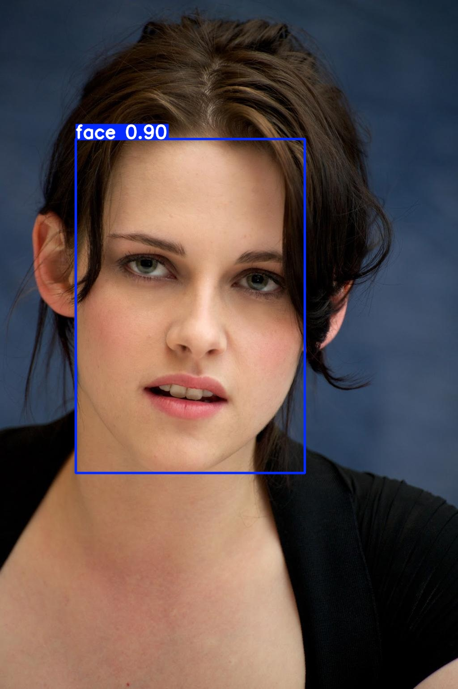
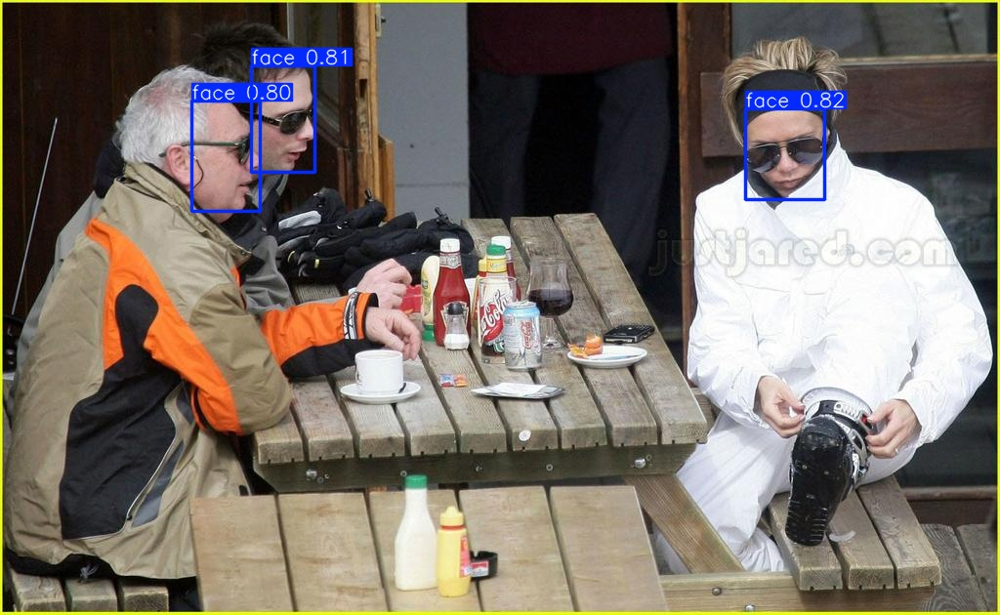

<!-- <div align="right">
  Language:
    🇺🇸
  <a title="Chinese" href="./README.zh-CN.md">🇨🇳</a>
</div> -->

<div align="center"><a title="" href="https://github.com/zjykzj/YOLO11Face"></a></div>

<p align="center">
  «YOLO11Face» combined YOLO5Face and YOLOv8/YOLO11 for face and keypoint detection
<br>
<br>
  <a href="https://github.com/RichardLitt/standard-readme"></a>
  <a href="https://conventionalcommits.org"></a>
  <a href="http://commitizen.github.io/cz-cli/"></a>
</p>

|                      |     ARCH     | GFLOPs | Easy  | Medium | Hard  |
|:--------------------:|:------------:|:------:|:-----:|:------:|:-----:|
| **zjykzj/YOLO5Face** | yolov5s-v7.0 |  15.8  | 94.84 | 93.28  | 84.67 |
| **zjykzj/YOLO5Face** | yolov5n-v7.0 |  4.2   | 93.25 | 91.11  | 80.33 |
|                      |              |        |       |        |       |
| **zjykzj/YOLO8Face** |   yolov5su   |  23.8  | 95.18 | 93.50  | 82.47 |
| **zjykzj/YOLO8Face** |   yolov5nu   |  7.1   | 93.96 | 91.82  | 78.89 |
|                      |              |        |       |        |       |
| **zjykzj/YOLO8Face** |   yolov8s    |  28.4  | 95.81 | 94.26  | 82.75 |
| **zjykzj/YOLO8Face** |   yolov8n    |  8.1   | 94.57 | 92.55  | 78.97 |
|                      |              |        |       |        |       |
| **zjykzj/YOLO8Face** | yolov8s-pose |  29.4  | 95.07 | 93.77  | 82.84 |
| **zjykzj/YOLO8Face** | yolov8n-pose |  8.3   | 94.07 | 92.04  | 78.88 |

*During the eval phase, using VGA resolution input images (the longer edge of the input image is scaled to 640, and the shorter edge is scaled accordingly)*

## Table of Contents✨

- [Table of Contents✨](#table-of-contents)
- [News🚀](#news)
- [Background🏷](#background)
- [Maintainers🔥](#maintainers)
- [Thanks♥️](#thanks️)
- [Contributing🌞](#contributing)
- [License✒️](#license️)

## News🚀

* **2025/02/21**: Upgrade the baseline version of the repository to `ultralytics v8.3.75`.
* **2025/02/15**: Trains a face and landmarks detector based on `YOLOv8-pose` and the WIDERFACE dataset.
* **2023/02/03**: Trains a face detector based on `YOLOv8` and the WIDERFACE dataset.
* **2025/01/09**: Initialize this repository using `ultralytics v8.2.103`.

## Background🏷

According to the [YOLO5Face](https://github.com/zjykzj/YOLO5Face) implementation, it adds `Landmarks-HEAD` to `YOLOv5` to achieve synchronous detection of faces and keypoints. The `YOLOv8/YOLO11` is an upgraded version of YOLOv5, which naturally improves the performance of face and keypoint detection by combining YOLO5Face and YOLOv8/YOLO11.

Through experiments, it was found that using `YOLOv8-pose/YOLO11-pose` can simultaneously detect faces and facial keypoints. Thank to ultralytics !!!

Note: the latest implementation of `YOLO11Face` in our warehouse is entirely based on [ultralytics/ultralytics v8.3.75](https://github.com/ultralytics/ultralytics/releases/tag/v8.3.75)

<!-- ## Installation

See [INSTALL.md](./yolo8face/docs/INSTALL.md)

## Usage  

Download the WIDERFACE dataset from http://shuoyang1213.me/WIDERFACE/, Then convert WIDERFACE dataset format.

```shell
$ python3 widerface2yolo-pose.py ../datasets/widerface/WIDER_train/images ../datasets/widerface/retinaface_gt_v1.1/train/label.txt ../datasets/widerface-landmarks/
```

### Train

```shell
# YOLOv8n-pose / YOLOv8s-pose
$ python3 pose_train.py --model yolov8n-pose.pt --data ./yolo8face/cfg/datasets/widerface-landmarks.yaml --epochs 100 --imgsz 640 --device 0
$ python3 pose_train.py --model yolov8s-pose.pt --data ./yolo8face/cfg/datasets/widerface-landmarks.yaml --epochs 100 --imgsz 640 --device 0
```

### Eval

```shell
# python pose_widerface.py --model yolov8s-pose_widerface.pt --source ../datasets/widerface/images/val/ --folder_pict ../datasets/widerface/wider_face_split/wider_face_val_bbx_gt.txt --save_txt true --conf 0.001 --iou 0.7 --max_det 300 --batch 1 --device 0
args: Namespace(data=None, device=[0], folder_pict='../datasets/widerface/wider_face_split/wider_face_val_bbx_gt.txt', model='yolov8s-pose_widerface.pt', source='../datasets/widerface/images/val/') - unknown: ['--save_txt', 'true', '--conf', '0.001', '--iou', '0.7', '--max_det', '300', '--batch', '1']
{'model': 'yolov8s-pose_widerface.pt', 'data': None, 'device': [0], 'source': '../datasets/widerface/images/val/', 'folder_pict': '../datasets/widerface/wider_face_split/wider_face_val_bbx_gt.txt', 'save_txt': True, 'conf': 0.001, 'iou': 0.7, 'max_det': 300, 'batch': 1, 'mode': 'predict'}
3226

Ultralytics YOLOv8.2.103 🚀 Python-3.8.19 torch-1.12.1+cu113 CUDA:0 (NVIDIA GeForce RTX 3090, 24268MiB)
YOLOv8s-pose summary (fused): 187 layers, 11,413,344 parameters, 0 gradients, 29.4 GFLOPs
...
...
Speed: 2.1ms preprocess, 12.9ms inference, 1.6ms postprocess per image at shape (1, 3, 640, 448)
Results saved to /data/zj/YOLO8Face/runs/detect/predict
0 label saved to /data/zj/YOLO8Face/runs/detect/predict/labels
# cd widerface_evaluate/
# python3 evaluation.py -p ../runs/detect/predict/labels/ -g ./ground_truth/
Reading Predictions : 100%|████████████████████████████████████████████████████████████████████████████████████████████████████████████████████████████████████████████████████████████████████████████████████████████████████████████████████████████████████████████████████████████████████████████████████████████████████████████| 61/61 [00:00<00:00, 116.17it/s]
Processing easy: 100%|██████████████████████████████████████████████████████████████████████████████████████████████████████████████████████████████████████████████████████████████████████████████████████████████████████████████████████████████████████████████████████████████████████████████████████████████████████████████████| 61/61 [00:18<00:00,  3.24it/s]
Processing medium: 100%|████████████████████████████████████████████████████████████████████████████████████████████████████████████████████████████████████████████████████████████████████████████████████████████████████████████████████████████████████████████████████████████████████████████████████████████████████████████████| 61/61 [00:18<00:00,  3.24it/s]
Processing hard: 100%|██████████████████████████████████████████████████████████████████████████████████████████████████████████████████████████████████████████████████████████████████████████████████████████████████████████████████████████████████████████████████████████████████████████████████████████████████████████████████| 61/61 [00:19<00:00,  3.21it/s]
==================== Results ====================
Easy   Val AP: 0.9507304597200303
Medium Val AP: 0.9376731961249901
Hard   Val AP: 0.8283959392916
=================================================
```

### Predict

```shell
# python3 pose_predict.py --model yolov8s-pose_widerface.pt --source ./yolo8face/assets/widerface_val/ --imgsz 640 --device 0
args: Namespace(data=None, device=[0], model='yolov8s-pose_widerface.pt', source='./yolo8face/assets/widerface_val/') - unknown: ['--imgsz', '640']

Ultralytics YOLOv8.2.103 🚀 Python-3.8.19 torch-1.12.1+cu113 CUDA:0 (NVIDIA GeForce RTX 3090, 24268MiB)
YOLOv8s-pose summary (fused): 187 layers, 11,413,344 parameters, 0 gradients, 29.4 GFLOPs
image 1/2 /data/zj/YOLO8Face/yolo8face/assets/widerface_val/39_Ice_Skating_iceskiing_39_351.jpg: 640x640 3 faces, 10.0ms
image 2/2 /data/zj/YOLO8Face/yolo8face/assets/widerface_val/9_Press_Conference_Press_Conference_9_632.jpg: 640x640 1 face, 10.0ms
Speed: 3.7ms preprocess, 10.0ms inference, 1.5ms postprocess per image at shape (2, 3, 640, 640)
Results saved to /data/zj/YOLO8Face/runs/detect/predict4
```

<p align="left">  </p> -->

## Maintainers🔥

* zhujian - *Initial work* - [zjykzj](https://github.com/zjykzj)

## Thanks♥️

* [ultralytics/ultralytics](https://github.com/ultralytics/ultralytics)
* [zjykzj/YOLO5Face](https://github.com/zjykzj/YOLO5Face)
* [deepcam-cn/yolov5-face](https://github.com/deepcam-cn/yolov5-face)

## Contributing🌞

Anyone's participation is welcome! Open an [issue](https://github.com/zjykzj/YOLO11Face/issues) or submit PRs.

## License✒️

[Apache License 2.0](LICENSE) © 2025 zjykzj