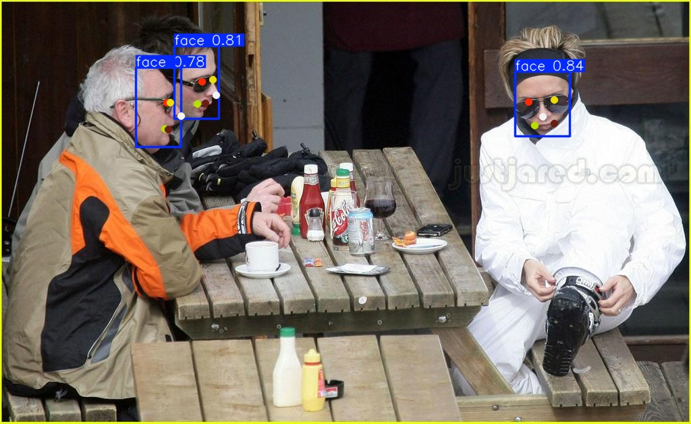

<!-- <div align="right">
  Language:
    🇺🇸
  <a title="Chinese" href="./README.zh-CN.md">🇨🇳</a>
</div> -->

<div align="center"><a title="" href="https://github.com/zjykzj/YOLO11Face"></a></div>

<p align="center">
  «YOLO11Face» combined YOLO5Face and YOLOv8/YOLO11 for face and keypoint detection
<br>
<br>
  <a href="https://github.com/RichardLitt/standard-readme"></a>
  <a href="https://conventionalcommits.org"></a>
  <a href="http://commitizen.github.io/cz-cli/"></a>
</p>

This warehouse has attempted to train two model architectures in total. The first one is to train and validate the `WIDERFACE` dataset using only the `yolov5/yolov8/yolo11` detection model architecture.

|                       |     ARCH     | GFLOPs | Easy  | Medium | Hard  |
|:---------------------:|:------------:|:------:|:-----:|:------:|:-----:|
| **zjykzj/YOLO11Face** |   yolov5nu   |  7.1   | 93.86 | 91.70  | 80.37 |
| **zjykzj/YOLO11Face** |   yolov5su   |  23.8  | 95.13 | 93.47  | 84.33 |
| **zjykzj/YOLO11Face** |   yolov8s    |  28.4  | 95.77 | 94.18  | 84.54 |
| **zjykzj/YOLO11Face** |   yolo11s    |  21.3  | 95.55 | 93.91  | 84.85 |

The second method uses `Ultralytics' pose model` for joint training of faces and keypoints, and finally evaluates only the facial performance of the validation set in the original way.

*Note that the facial keypoint annotation here comes from RetinaFace, which only annotated facial keypoints on the original training set. Therefore, when training the pose model, the training part of the original WIDERFACE `train` dataset is divided into `training/validation` datasets in an `8:2` ratio, and the `val` dataset is evaluated after training is completed.*

|                       |     ARCH     | GFLOPs | Easy  | Medium | Hard  |
|:---------------------:|:------------:|:------:|:-----:|:------:|:-----:|
| **zjykzj/YOLO5Face**  | yolov5n-v7.0 |  4.2   | 93.25 | 91.11  | 80.33 |
| **zjykzj/YOLO5Face**  | yolov5s-v7.0 |  15.8  | 94.84 | 93.28  | 84.67 |
|                       |              |        |       |        |       |
| **zjykzj/YOLO11Face** | yolov8n-pose |  8.3   | 94.61 | 92.46  | 80.98 |
| **zjykzj/YOLO11Face** | yolov8s-pose |  29.4  | 95.50 | 93.95  | 84.65 |
|                       |              |        |       |        |       |
| **zjykzj/YOLO11Face**  | yolo11n-pose |  6.6   | 94.62 | 92.56  | 81.02 |
| **zjykzj/YOLO11Face**  | yolo11s-pose |  22.3  | 95.72 | 94.19  | 85.24 |

*During the eval phase, using VGA resolution input images (the longer edge of the input image is scaled to 640, and the shorter edge is scaled accordingly)*

## Table of Contents✨

- [Table of Contents✨](#table-of-contents)
- [News🚀](#news)
- [Background🏷](#background)
- [Installation](#installation)
- [Usage](#usage)
  - [Train](#train)
  - [Eval](#eval)
  - [Predict](#predict)
- [Maintainers🔥](#maintainers)
- [Thanks♥️](#thanks️)
- [Contributing🌞](#contributing)
- [License✒️](#license️)

## News🚀

* **2025/02/21**: Upgrade the baseline version of the repository to `ultralytics v8.3.75`.
* **2025/02/15**: Trains a face and landmarks detector based on `YOLOv8-pose` and the WIDERFACE dataset.
* **2023/02/03**: Trains a face detector based on `YOLOv8` and the WIDERFACE dataset.
* **2025/01/09**: Initialize this repository using `ultralytics v8.2.103`.

## Background🏷

According to the [YOLO5Face](https://github.com/zjykzj/YOLO5Face) implementation, it adds `Landmarks-HEAD` to `YOLOv5` to achieve synchronous detection of faces and keypoints. The `YOLOv8/YOLO11` is an upgraded version of YOLOv5, which naturally improves the performance of face and keypoint detection by combining YOLO5Face and YOLOv8/YOLO11.

Through experiments, it was found that using `YOLOv8-pose/YOLO11-pose` can simultaneously detect faces and facial keypoints. Thank to ultralytics !!!

Note: the latest implementation of `YOLO11Face` in our warehouse is entirely based on [ultralytics/ultralytics v8.3.75](https://github.com/ultralytics/ultralytics/releases/tag/v8.3.75)

## Installation

See [INSTALL.md](./yolo8face/docs/INSTALL.md)

## Usage

### Train

```shell
$ python3 pose_train.py --model yolo11s-pose.pt --data ./yolo11face/cfg/datasets/widerface-landmarks.yaml --epochs 300 --imgsz 800 --batch 8 --device 0
```

### Eval

```shell
# python pose_widerface.py --model yolo11s-pose_widerface.pt --source ../datasets/widerface/images/val/ --folder_pict ../datasets/widerface/wider_face_split/wider_face_val_bbx_gt.txt --save_txt true --imgsz 640 --conf 0.001 --iou 0.6 --max_det 1000 --batch 1 --device 7
args: Namespace(data=None, device=[7], folder_pict='../datasets/widerface/wider_face_split/wider_face_val_bbx_gt.txt', model='yolo11s-pose_widerface.pt', source='../datasets/widerface/images/val/') - unknown: ['--save_txt', 'true', '--imgsz', '640', '--conf', '0.001', '--iou', '0.6', '--max_det', '1000', '--batch', '1']
{'model': 'yolo11s-pose_widerface.pt', 'data': None, 'device': [7], 'source': '../datasets/widerface/images/val/', 'folder_pict': '../datasets/widerface/wider_face_split/wider_face_val_bbx_gt.txt', 'save_txt': True, 'imgsz': 640, 'conf': 0.001, 'iou': 0.6, 'max_det': 1000, 'batch': 1, 'mode': 'predict'}
3226

Ultralytics 8.3.75 🚀 Python-3.8.19 torch-1.12.1+cu113 CUDA:7 (NVIDIA GeForce RTX 3090, 24268MiB)
YOLO11s-pose summary (fused): 257 layers, 9,700,560 parameters, 0 gradients, 22.3 GFLOPs
...
...
Speed: 2.0ms preprocess, 14.4ms inference, 1.4ms postprocess per image at shape (1, 3, 640, 448)
Results saved to /data/zj/YOLO11Face/runs/detect/predict3
0 label saved to /data/zj/YOLO11Face/runs/detect/predict3/labels
# cd widerface_evaluate/
# python3 evaluation.py -p ../runs/detect/predict3/labels/ -g ./ground_truth/
Reading Predictions : 100%|███████████████████████████████████████████████████████████████████████████████████████████████████████████████████████████████████████████████████| 61/61 [00:00<00:00, 115.26it/s]
Processing easy: 100%|█████████████████████████████████████████████████████████████████████████████████████████████████████████████████████████████████████████████████████████| 61/61 [00:19<00:00,  3.20it/s]
Processing medium: 100%|███████████████████████████████████████████████████████████████████████████████████████████████████████████████████████████████████████████████████████| 61/61 [00:18<00:00,  3.22it/s]
Processing hard: 100%|█████████████████████████████████████████████████████████████████████████████████████████████████████████████████████████████████████████████████████████| 61/61 [00:18<00:00,  3.21it/s]
==================== Results ====================
Easy   Val AP: 0.9572097672239526
Medium Val AP: 0.9419027051471077
Hard   Val AP: 0.8523522955677869
=================================================
```

### Predict

```shell
# python3 pose_predict.py --model yolo11s-pose_widerface.pt --source ./yolo11face/assets/widerface_val/ --imgsz 640 --device 0
args: Namespace(data=None, device=[0], model='yolo11s-pose_widerface.pt', source='./yolo11face/assets/widerface_val/') - unknown: ['--imgsz', '640']

Ultralytics 8.3.75 🚀 Python-3.8.19 torch-1.12.1+cu113 CUDA:0 (NVIDIA GeForce RTX 3090, 24268MiB)
YOLO11s-pose summary (fused): 257 layers, 9,700,560 parameters, 0 gradients, 22.3 GFLOPs
image 1/2 /data/zj/YOLO11Face/yolo11face/assets/widerface_val/39_Ice_Skating_iceskiing_39_351.jpg: 640x640 3 faces, 22.8ms
image 2/2 /data/zj/YOLO11Face/yolo11face/assets/widerface_val/9_Press_Conference_Press_Conference_9_632.jpg: 640x640 1 face, 22.8ms
Speed: 3.1ms preprocess, 22.8ms inference, 1.8ms postprocess per image at shape (2, 3, 640, 640)
Results saved to /data/zj/YOLO11Face/runs/detect/predict10
```

<p align="left">  </p>

## Maintainers🔥

* zhujian - *Initial work* - [zjykzj](https://github.com/zjykzj)

## Thanks♥️

* [ultralytics/ultralytics](https://github.com/ultralytics/ultralytics)
* [zjykzj/YOLO5Face](https://github.com/zjykzj/YOLO5Face)
* [deepcam-cn/yolov5-face](https://github.com/deepcam-cn/yolov5-face)

## Contributing🌞

Anyone's participation is welcome! Open an [issue](https://github.com/zjykzj/YOLO11Face/issues) or submit PRs.

## License✒️

[Apache License 2.0](LICENSE) © 2025 zjykzj